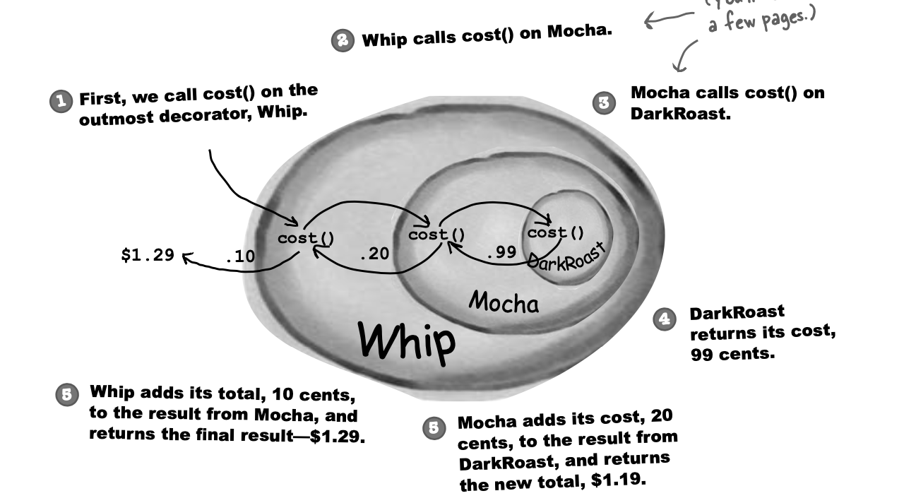

# Decorator Pattern
Python implementation

## Beverage With Condiments Example
- extend new behavior (ie. add new condiment) without modifying Beverage component
- add up `cost` for every time adding condiment to beverage

