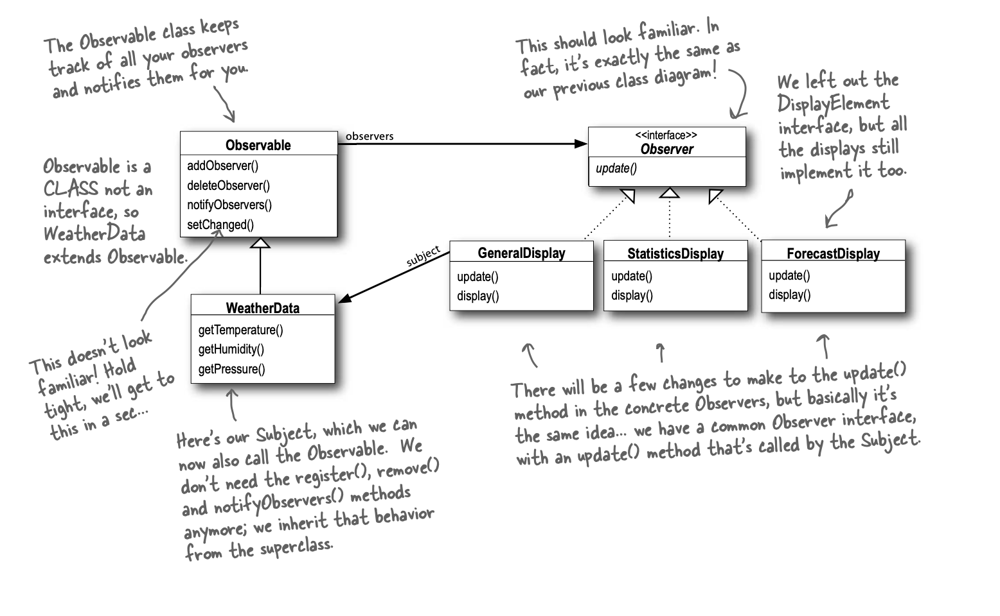

# Observer Pattern 
Python implementation

## Weather Station Example
The example mentioned in book which using Java built-in Observable class
- Implements many kind of `Display Observers` are able to subscribe every change of the `Weather Station`
- All observer will update the display when weather change

